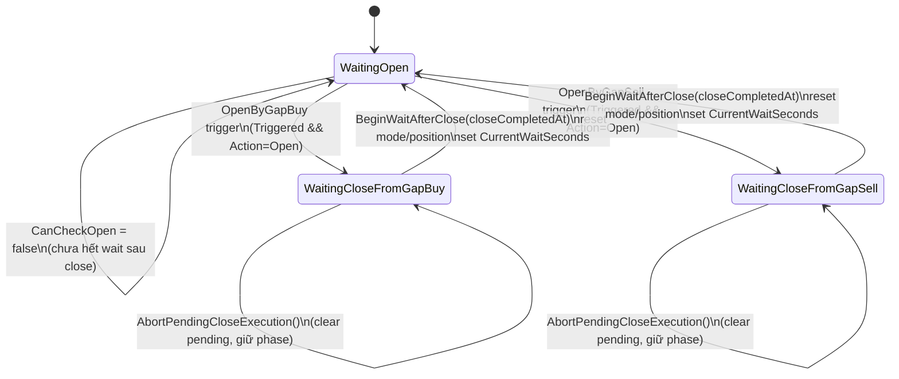
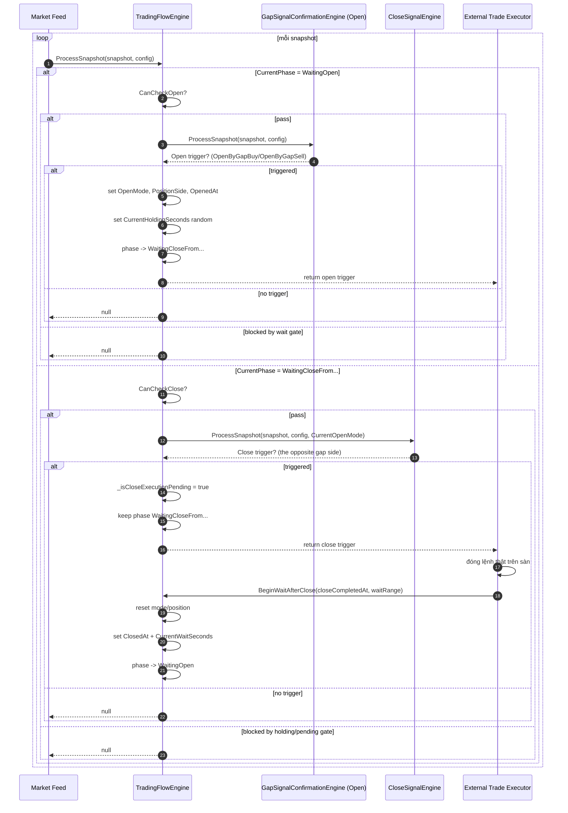

# Tổng hợp logic mở/đóng lệnh và lifecycle (TradingFlowEngine)

Tài liệu này tổng hợp chi tiết các luồng xử lý **mở lệnh (open)**, **đóng lệnh (close)**, các case quan trọng và **lifecycle end-to-end** trong hệ thống.

---

## 1) Thành phần chính tham gia flow

- `TradingFlowEngine`: state machine trung tâm, điều phối open/close, hold/wait timer, pending-close.
- `IOpenSignalEngine` (implement bởi `GapSignalConfirmationEngine`): phát hiện tín hiệu mở lệnh.
- `ICloseSignalEngine` (implement bởi `CloseSignalEngine`): phát hiện tín hiệu đóng lệnh theo mode đang mở.
- `GapSignalConfirmationConfig`: cấu hình ngưỡng + thời gian:
  - Open: `ConfirmGapPts`, `OpenPts`, `HoldConfirmMs`
  - Close: `CloseConfirmGapPts`, `ClosePts`, `CloseHoldConfirmMs`
  - Time guard: `StartTimeHold`, `EndTimeHold`, `StartWaitTime`, `EndWaitTime`

---

## 2) State machine và dữ liệu trạng thái

### 2.1 Các phase (`TradingFlowPhase`)

1. `WaitingOpen`: chờ cơ hội mở lệnh.
2. `WaitingCloseFromGapBuy`: đã mở theo `GapBuy`, chờ tín hiệu đóng.
3. `WaitingCloseFromGapSell`: đã mở theo `GapSell`, chờ tín hiệu đóng.

### 2.2 Các state quan trọng

- `CurrentOpenMode`: `None | GapBuy | GapSell`
- `CurrentPositionSide`: `None | Buy | Sell`
- `OpenedAtUtc`, `ClosedAtUtc`
- `CurrentHoldingSeconds`: thời gian giữ lệnh tối thiểu trước khi cho check close
- `CurrentWaitSeconds`: thời gian chờ tối thiểu sau close trước khi cho check open
- `_isCloseExecutionPending`: cờ cho biết đã có close trigger và đang chờ xác nhận đóng lệnh thực tế từ bên ngoài

---

## 3) Logic mở lệnh (OPEN) chi tiết

Open chỉ được xử lý khi `CurrentPhase == WaitingOpen`.

### Bước 1: Gate thời gian mở (`CanCheckOpen`)

- Nếu `ClosedAtUtc` chưa có **hoặc** `CurrentWaitSeconds <= 0` ⇒ cho check open ngay.
- Nếu đang có wait time sau close:
  - baseline = `_closedAtRuntimeUtc ?? ClosedAtUtc`
  - elapsed = `ResolveEffectiveNowUtc(snapshot.TimestampUtc) - baseline`
  - chỉ cho check khi `elapsed >= CurrentWaitSeconds`.

### Bước 2: Lấy trigger open

`openSignalEngine.ProcessSnapshot(snapshot, config)` trả danh sách trigger tiềm năng cho cả 2 phía:

- `OpenByGapBuy` (side Buy)
- `OpenByGapSell` (side Sell)

`TradingFlowEngine` lấy phần tử đầu tiên thỏa:

- `Triggered == true`
- `Action == Open`

### Bước 3: Cơ chế xác nhận open trong `GapSignalConfirmationEngine`

Mỗi side có `SideWindowState` riêng (window theo thời gian):

1. `primaryGap` phải qua ngưỡng confirm:
   - Buy path: `gapBuy >= ConfirmGapPts`
   - Sell path: `gapSell <= -ConfirmGapPts`
   - nếu fail: reset state ngay.
2. Khi pass confirm, bắt đầu/duy trì window và tích lũy samples gap.
3. Nếu chưa đủ `HoldConfirmMs` thì chưa trigger.
4. Khi đủ hold time, toàn bộ samples trong window phải vẫn thỏa confirm (nếu có sample fail thì reset).
5. Sample cuối phải thỏa ngưỡng mở mạnh hơn:
   - Buy: `lastGap >= OpenPts`
   - Sell: `lastGap <= -OpenPts`
6. Nếu pass toàn bộ ⇒ trả `GapSignalTriggerResult` và reset window state.

### Bước 4: Update state khi open thành công

- `CurrentOpenMode = GapBuy | GapSell`
- `CurrentPositionSide = Buy | Sell`
- `OpenedAtUtc = trigger.TriggeredAtUtc`
- `_openedAtRuntimeUtc = DateTime.UtcNow`
- `CurrentHoldingSeconds = random(StartTimeHold..EndTimeHold)`
- chuyển phase:
  - `GapBuy` → `WaitingCloseFromGapBuy`
  - `GapSell` → `WaitingCloseFromGapSell`
- clear pending-close + reset open/close engine internal state.

---

## 4) Logic đóng lệnh (CLOSE) chi tiết

Close chỉ được xử lý khi đang ở waiting-close hợp lệ và mode/position không phải `None`.

### Bước 1: Gate thời gian đóng (`CanCheckClose`)

- Nếu `_isCloseExecutionPending == true` ⇒ block close check (tránh trigger chồng).
- Nếu chưa có `OpenedAtUtc` **hoặc** `CurrentHoldingSeconds <= 0` ⇒ cho check close ngay.
- Ngược lại:
  - baseline = `_openedAtRuntimeUtc ?? OpenedAtUtc`
  - elapsed = `ResolveEffectiveNowUtc(snapshot.TimestampUtc) - baseline`
  - chỉ check close khi `elapsed >= CurrentHoldingSeconds`.

### Bước 2: Rule đóng theo mode đang mở (`CloseSignalEngine`)

- Nếu mở bằng `GapBuy` ⇒ close hợp lệ là `CloseByGapSell`:
  - confirm: `gapSell <= -CloseConfirmGapPts`
  - ngưỡng kích hoạt cuối: `gapSell <= -ClosePts`
- Nếu mở bằng `GapSell` ⇒ close hợp lệ là `CloseByGapBuy`:
  - confirm: `gapBuy >= CloseConfirmGapPts`
  - ngưỡng kích hoạt cuối: `gapBuy >= ClosePts`

Window/hold logic dùng cùng cơ chế `ProcessSide` như open, với `CloseHoldConfirmMs`.

### Bước 3: Khi close trigger thành công

- `_isCloseExecutionPending = true`
- `ClosedAtUtc = null`
- `CurrentWaitSeconds = 0`
- reset open/close engine
- **giữ nguyên phase waiting-close** (chưa quay về `WaitingOpen` ngay)
- trả close trigger để tầng execution đi đóng lệnh thật.

### Bước 4: Xác nhận đóng thực tế từ external (`BeginWaitAfterClose`)

Khi bên ngoài báo đóng xong:

- cho phép transition theo hướng idempotent/resilient (kể cả vài path race)
- clear pending-close
- reset vị thế:
  - `CurrentPhase = WaitingOpen`
  - `CurrentOpenMode = None`
  - `CurrentPositionSide = None`
  - `OpenedAtUtc = null`
  - `CurrentHoldingSeconds = 0`
- set mốc close:
  - `ClosedAtUtc = closeCompletedAtUtc`
  - `_closedAtRuntimeUtc = DateTime.UtcNow`
- set wait ngẫu nhiên:
  - `CurrentWaitSeconds = random(startWaitSeconds..endWaitSeconds)`
- reset engine state.

### Bước 5: Huỷ pending close (`AbortPendingCloseExecution`)

- chỉ tác dụng khi `_isCloseExecutionPending == true`
- clear pending + clear marker wait/close runtime
- reset close engine
- phase vẫn giữ waiting-close (không tự chuyển `WaitingOpen`).

---

## 5) Lifecycle end-to-end (tóm tắt)

1. `WaitingOpen`
2. Qua wait gate → check open signal (confirm window + hold)
3. Trigger open → set mode/side + holding seconds → sang `WaitingCloseFrom...`
4. Qua holding gate → check close signal đối ứng
5. Trigger close → set pending close execution (vẫn waiting-close)
6. External close done → `BeginWaitAfterClose(...)`
7. Reset về `WaitingOpen`, set wait seconds và lặp chu kỳ mới

---

## 6) State Diagram (Mermaid)

---

## 7) Sequence Diagram (Mermaid)

---

## 8) Bảng mapping nhanh open/close

| Open mode đã vào | Close trigger hợp lệ | Điều kiện gap close |
|---|---|---|
| `GapBuy` | `CloseByGapSell` | `gapSell <= -CloseConfirmGapPts` trong window và điểm cuối `<= -ClosePts` |
| `GapSell` | `CloseByGapBuy` | `gapBuy >= CloseConfirmGapPts` trong window và điểm cuối `>= ClosePts` |

---

## 9) Các case quan trọng đã được test

- Open Buy → Close by GapSell (happy path)
- Open Sell → Close by GapBuy (happy path)
- Chưa đủ holding time ⇒ close bị chặn
- Chưa đủ waiting time sau close ⇒ open bị chặn
- Range min/max bị đảo ⇒ engine tự swap, không crash
- Pending-close bị abort trước ⇒ `BeginWaitAfterClose` vẫn có thể đưa về `WaitingOpen`
- Snapshot timestamp stale nhưng gần wall-clock ⇒ timer vẫn tiến nhờ fallback `ResolveEffectiveNowUtc`
